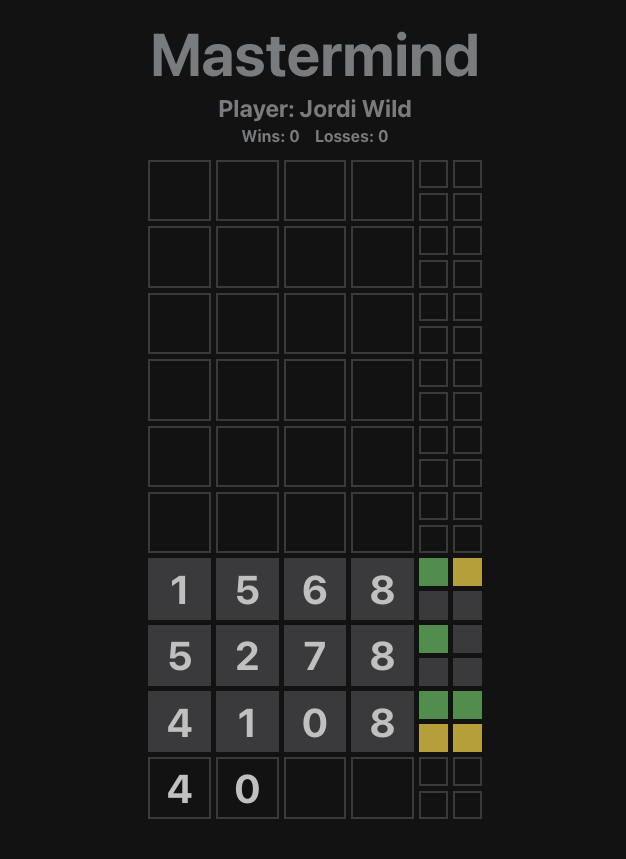

# Mastermind - 2022-UDG-MM-HMP1P2

## Tech Stack
[React](https://reactjs.org/)

It's remarkably flexible and confortable to use, it allows us to easily create fast user interfaces.

[TypeScript](https://typescriptlang.org/)

It extends JavaScript and improves the developer experience, adding various other features. One of those key features is that it always points out the compilation errors at the time of development (pre-compilation).

## Development
Requirement: [**Node.js**](https://nodejs.org/)
1. Install dependencies `npm install`
2. Run dev server `npm run dev`
3. Open `http://localhost:3000/`
## License
[MIT](LICENSE)

Made by Gerard Sáez & Jordi Soler 
